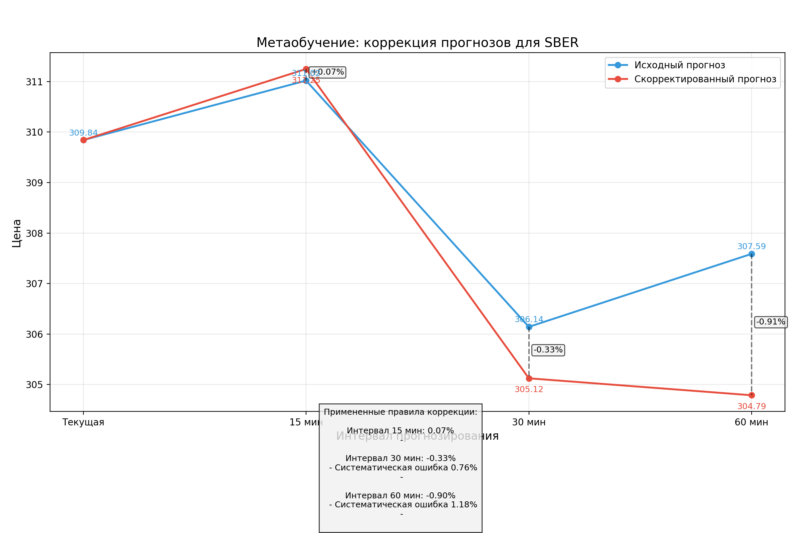

# PrismTrade - Аналитическая платформа для прогнозирования цен акций


## Описание проекта

PrismTrade - это мощная аналитическая платформа для прогнозирования цен акций российского фондового рынка, работающая через Tinkoff API. Применяя методы машинного обучения и технического анализа, платформа предоставляет точные прогнозы и обоснованные торговые рекомендации для инвесторов.

## Основные возможности

- 🔮 **Мультиинтервальное прогнозирование цен** - прогнозы на 15, 30 и 60 минут вперед
- 📊 **Расширенный технический анализ** - RSI, MACD, скользящие средние, полосы Боллинджера и многое другое
- 📈 **Анализ рыночного состояния** - определение тренда, волатильности, коррекций и точек входа
- 🧠 **Метаобучение** - система постоянно совершенствует свои прогнозы на основе исторических результатов
- 🤖 **Ансамблевые модели** - комбинирование различных алгоритмов (линейная регрессия, градиентный бустинг, LSTM, ARIMA)
- 💰 **Рекомендации по торговле** - четкие сигналы на покупку и продажу с указанием уровней входа, выхода и стоп-лосс
- 📉 **Анализ точности прогнозов** - подробная статистика по историческим прогнозам

## Технологии

- **Backend**: Python, FastAPI, Uvicorn
- **Data Analysis**: NumPy, Pandas, Scikit-learn, TensorFlow
- **Визуализация**: Matplotlib, Seaborn
- **API**: Tinkoff Investments API
- **Frontend**: HTML, JavaScript (AJAX)

## Установка и настройка

### Предварительные требования

- Python 3.11 или выше
- Токен Tinkoff API (инвестиционный счет)

### Шаги по установке

1. Клонируйте репозиторий:
```bash
git clone https://github.com/your-username/prismtrade.git
cd prismtrade
```

2. Установите зависимости:
```bash
pip install -r requirements.txt
```

3. Настройте токен API Tinkoff в секретах (Tools -> Secrets в Replit) или создайте переменную окружения:
```bash
export TINKOFF_TOKEN=your_token_here
```

4. Запустите сервер:
```bash
python main.py
```

## Использование

1. Откройте веб-интерфейс по адресу http://localhost:8080
2. Введите тикер акции (например, SBER, GAZP, LKOH)
3. Получите прогноз и рекомендации по торговле

## Основные компоненты

### StockPredictor

Ядро системы, отвечающее за:
- Сбор данных через Tinkoff API
- Расчет технических индикаторов
- Анализ состояния рынка
- Генерацию прогнозов и рекомендаций

### PredictionAnalytics

Модуль анализа точности прогнозов, включающий:
- Оценку исторической точности прогнозов
- Построение расширенных моделей (LSTM, ARIMA)
- Метаобучение и корректировку прогнозов
- Оптимизацию весов ансамблевых моделей

## Примеры работы

### Прогноз и анализ рынка


### Метаобучение


### Ансамблевые модели


## Структура проекта

```
prismtrade/
├── main.py                  # Основной файл приложения
├── prediction_analytics.py  # Модуль для анализа точности прогнозов  
├── templates/               # HTML шаблоны
│   └── index.html           # Главная страница веб-интерфейса
├── static/                  # Статические файлы
│   ├── analytics/           # Графики для аналитики
│   └── stock_prediction.png # Графики прогнозов
└── data/                    # Данные и история прогнозов
    └── predictions/         # Архив прогнозов по тикерам
```

## Основные алгоритмы

1. **Базовый прогноз** - на основе линейной регрессии, полиномиальной регрессии и градиентного бустинга
2. **Продвинутые модели** - LSTM (долгая краткосрочная память) и ARIMA для временных рядов
3. **Ансамблевые методы** - динамическое взвешивание моделей с учетом рыночных условий
4. **Анализ рыночного состояния** - определение трендов, откатов, дивергенций и паттернов объема
5. **Метаобучение** - система корректировки прогнозов на основе исторических ошибок

## Рекомендации по использованию

- Используйте прогнозы в сочетании с собственным анализом рынка
- Учитывайте, что короткосрочные прогнозы (15 минут) обычно точнее долгосрочных
- Обращайте внимание на уровень уверенности рекомендаций
- Используйте рекомендуемые уровни стоп-лосс для управления рисками

## Лицензия

MIT License

## Автор

Ваше имя - [Ваш email](mailto:your.email@example.com)

## Благодарности

- Tinkoff API за предоставление доступа к данным фондового рынка
- Сообществу open-source за инструменты и библиотеки

---

**Дисклеймер**: Торговля на финансовых рынках связана с риском. Прогнозы и рекомендации, предоставляемые данной системой, предназначены только для информационных целей и не являются финансовой консультацией. Автор не несет ответственности за любые финансовые потери.
